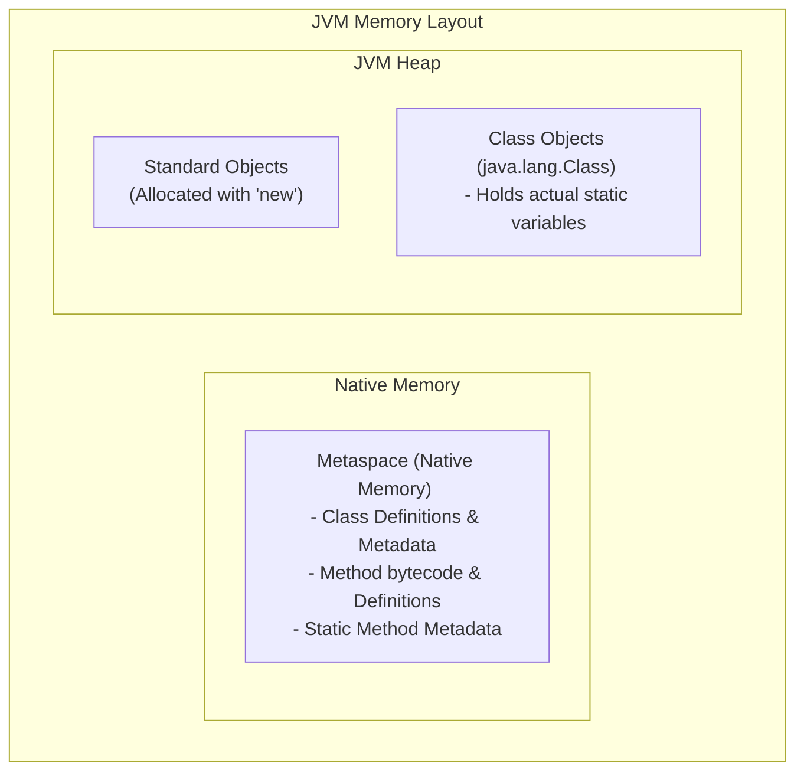

# The `static` Keyword in Java

In Java, the `static` keyword is a non-access modifier used mainly for **efficient memory management**. 

When you declare a member (variable, method, block, or nested class) as `static`, it means that member belongs to the **class itself** rather than to any specific instance (object) of the class.

---

## 🛠️ Main Uses of `static`

### 1. Static Variables (Class Variables)
A static variable is shared among all instances of a class. Memory for static variables is allocated only once when the class is loaded.
* **Why use it**: To represent properties that are common to all objects (saves memory).
* **Code Example**:
  ```java
  class Student {
      String name; // Unique for each student
      static String college = "MIT"; // Shared by all students (Only 1 copy in memory)

      Student(String name) {
          this.name = name;
      }
  }
  ```
* **Usage**:
  ```java
  System.out.println(Student.college); // Access directly via Class name: MIT
  ```

### 2. Static Methods
A static method belongs to the class and can be invoked without creating an instance of the class.
* **Why use it**: For utility or helper methods that do not need state from an object (e.g., `Math.sqrt()`).
* **Code Example**:
  ```java
  class Calculator {
      public static int add(int a, int b) { // Static method
          return a + b;
      }
  }
  ```
* **Usage**:
  ```java
  int result = Calculator.add(5, 10); // Called without "new Calculator()"
  ```
* **⚠️ Restrictions for Static Methods**:
  * They **cannot** access non-static (instance) variables or call non-static methods directly.
  * They **cannot** use the `this` or `super` keywords.

### 3. Static Blocks
A static block is used to initialize static variables. It executes **exactly once** when the class is first loaded into memory by the JVM, even before the `main` method runs.
* **Code Example**:
  ```java
  class DatabaseConnector {
      static String connectionUrl;

      static { // Static initialization block
          connectionUrl = "jdbc:mysql://localhost:3306/mydb";
          System.out.println("Static block: Connection URL initialized!");
      }
  }
  ```

### 4. Static Nested Classes
In Java, you cannot make an outer class static, but you can make an **inner (nested) class** static.
* **Why use it**: A static nested class does not require a reference to the outer class instance, making it decoupled and memory-efficient.
* **Code Example**:
  ```java
  class Outer {
      static class Nested {
          void greet() {
              System.out.println("Hello from static nested class!");
          }
      }
  }
  ```
* **Usage**:
  ```java
  Outer.Nested node = new Outer.Nested(); // No outer instance needed!
  ```

---

## 🆚 Static vs Instance (Summary Table)

| Feature | `static` Member | Instance (Non-static) Member |
| :--- | :--- | :--- |
| **Ownership** | Belongs to the **Class**. | Belongs to the **Object (Instance)**. |
| **Memory Allocation** | Allocated once when class is loaded. | Allocated every time an object is created. |
| **Access Way** | Using Class Name (`ClassName.member`). | Using Object Reference (`objectName.member`). |
| **Usage of `this`** | Cannot use `this` or `super`. | Can freely use `this` and `super`. |

---

## 🔗 Indirect Access of Instance Members in Static Methods

A static method does **not** have an implicit `this` reference, meaning it does not know which object's instance variable to access. However, **you can access instance variables/methods indirectly by explicitly passing or creating an object reference** inside the static method.

### Code Example:
```java
public class Employee {
    // Instance variables
    String name = "Alice";
    int salary = 50000;

    // Instance method
    public void printDetails() {
        System.out.println(name + " earns " + salary);
    }

    // Static method
    public static void displayReport(Employee emp) {
        // ❌ DIRECT ACCESS IS FORBIDDEN:
        // System.out.println(name); // Compile Error
        // printDetails();           // Compile Error

        // ✅ INDIRECT ACCESS IS ALLOWED (using object reference):
        System.out.println("Accessing name via parameter: " + emp.name);
        emp.printDetails(); 

        // ✅ Or by instantiating inside the static method:
        Employee tempEmp = new Employee();
        System.out.println("Accessing name via new instance: " + tempEmp.name);
    }
}
```

---

## 🧠 Where are Static Variables and Methods Stored in Memory?

Java's Memory Model changed significantly starting in **Java 8**:



### 1. Static Variables (The actual data)
* **Java 8 and newer**: They are stored on the **Heap** (specifically, inside the `java.lang.Class` object associated with the loaded class). Any objects pointed to by static references also reside on the normal heap.
* **Prior to Java 8 (Legacy)**: They were stored in the **PermGen** (Permanent Generation) space, which was a separate area of the heap.

### 2. Static Methods (Method Definitions/Bytecode)
* The bytecode, signature, metadata, and structural definitions of **all methods** (both static and non-static) are stored in the **Metaspace** (Native Memory outside the JVM Heap) starting from Java 8.
* When a static method is executed, its local variables and execution frame are pushed onto the calling thread's **Stack**, just like any other method execution.


---

## 🔍 Memory Allocation for Multiple Instances (FAQ)

### Question:
If we have a class with a static variable and a non-static (instance) variable, and we create **4 instances** of this class:
1. Are the non-static variables allocated 4 times in memory?
2. Are they allocated on the **Stack** or the **Heap**?

### Answer:

1. **Yes, the non-static variable is allocated 4 times in memory.** Every single time you use `new`, a brand new object is created, and it gets its own independent copy of all non-static (instance) variables.
2. **They are allocated on the Heap, NOT the Stack.** In Java, all objects and their instance variables live on the **Heap**. The **Stack** only stores the local reference variables (pointers) that point to those Heap objects.
3. **The static variable is allocated only ONCE.** It is stored in the `java.lang.Class` object on the Heap and is shared by all 4 instances.

### Visual Representation of Memory Allocation:

Given the following code:
```java
class Demo {
    static int staticVar = 100;
    int instanceVar = 5;
}

// Inside a method:
Demo obj1 = new Demo();
Demo obj2 = new Demo();
Demo obj3 = new Demo();
Demo obj4 = new Demo();
```

Here is how JVM memory looks:

```
               STACK AREA                                    HEAP AREA
      (Stores Reference Variables)                 (Stores Actual Objects & Data)
      
    +------------------------------+             +----------------------------------+
    | obj4 (points to Object 4) ---|------------>| Object 4 (Demo)                  |
    |                              |             |  - instanceVar = 5               |
    +------------------------------+             +----------------------------------+
    | obj3 (points to Object 3) ---|------------>| Object 3 (Demo)                  |
    |                              |             |  - instanceVar = 5               |
    +------------------------------+             +----------------------------------+
    | obj2 (points to Object 2) ---|------------>| Object 2 (Demo)                  |
    |                              |             |  - instanceVar = 5               |
    +------------------------------+             +----------------------------------+
    | obj1 (points to Object 1) ---|------------>| Object 1 (Demo)                  |
    |                              |             |  - instanceVar = 5               |
    +------------------------------+             +----------------------------------+
                                                 | Class Object (Demo.class)        |
                                                 |  - staticVar = 100               |
                                                 |   (Shared by all instances)      |
                                                 +----------------------------------+
```

### Key Takeaway:
* **Stack**: Holds **references** (`obj1`, `obj2`, `obj3`, `obj4`) to the objects. These references are temporary and disappear when the method finishes executing.
* **Heap**: Holds the **actual objects** and their **instance variables**. Since we created 4 objects, we have 4 copies of the instance variables on the Heap.


